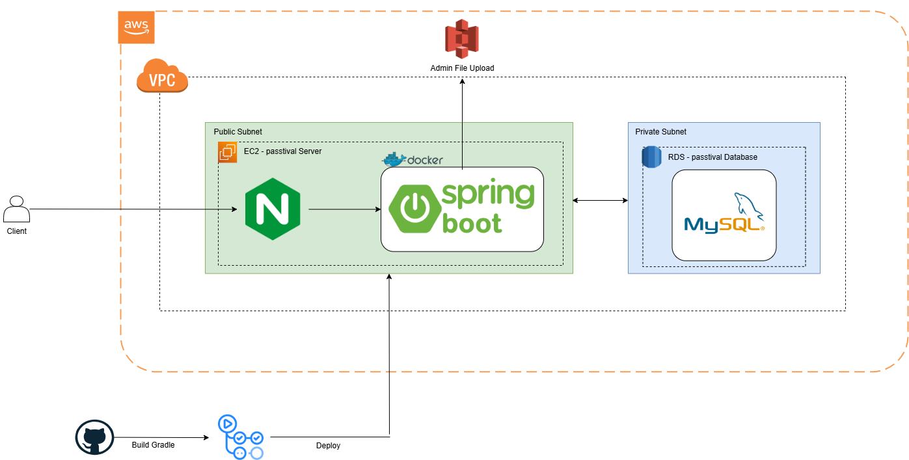

 Passtival - AYU - 2025

---

---

 🤼‍♀️ 팀원 소개

| 이름      | GitHub                                                                                                                         | 프로필                                                                                               | 역할      |
|---------|--------------------------------------------------------------------------------------------------------------------------------|---------------------------------------------------------------------------------------------------|---------|
| **박준선** |  |  | 관리자 기능  |
| **이원진** |     |     | 회원 기능, 번호팅 |
| **윤재상** |     |     | 공연/부스 정보 |

---

📌 Passtival 사이트 바로가기

<a href="htps://passtival.co.kr" target="_blank">https://passtival.co.kr</a>

---

  

Passtival-server는 대학 축제 서비스 Passtival의 백엔드 API 서버입니다.  
공연/부스 정보 제공, 분실물 관리, 응모권(경품) 및 번호팅 매칭, S3 이미지 업로드, 관리자 기능 등을 제공합니다.

[회원 및 인증/인가 전략](document/strategy/memberAuth.md)  

---

 아키텍처 

